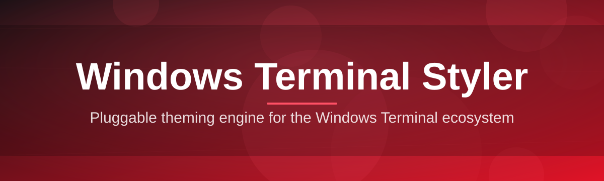

# terminal-style-configurator 🎨✨

  

*Turn your Windows Terminal from a blinking cursor into a canvas — no config file archaeology required.*

  

## 🌱 Overview

Every terminal power-user remembers the first time they opened `settings.json` and stared into the abyss of nested JSON keys, hex codes, and undocumented schema fields. `terminal-style-configurator` was born out of that exact frustration — a weekend project that started as a scratch-pad for tweaking one developer's color scheme and slowly grew into a full visual styling console for Windows Terminal. What began as "just add a color picker" turned into a community-driven Windows Terminal Styler that thousands of contributors, theme designers, and terminal tinkerers now rely on.

At its core, this project exists to close the gap between *what you want your terminal to look like* and *what you actually have to type to get there*. Windows Terminal is powerful but its styling surface — color schemes, cursor shapes, acrylic opacity, background images, font ligatures, tab colors — lives buried in raw JSON. The configurator gives that surface a face: sliders instead of floats, swatches instead of hex strings, live previews instead of save-and-reopen guesswork.

It's built for everyone from the developer who just wants a Solarized-adjacent theme in ninety seconds, to the terminal aesthete who wants to fine-tune acrylic blur radius and cursor blink timing down to the millisecond. Whether you're setting up a fresh Windows 11 dev box or restyling a decade-old PowerShell habit, this tool meets you where you are.

---

## 🧩 What's In The Toolbox

Two columns, zero fluff — every capability the styler ships with, and why it matters.

| Capability | What it actually does |
|---|---|
| **Live Theme Canvas** | Renders your terminal profile in a real preview pane as you drag sliders — see acrylic, fonts, and color shifts *before* committing to `settings.json`. |
| **Palette Forge** | Build a 16-color ANSI scheme from a single accent color using harmonic generation, or import an existing scheme and remix it swatch by swatch. |
| **Profile Cloner** | Duplicate any existing shell profile (PowerShell, WSL, Git Bash, Azure Cloud Shell) and re-skin the clone without touching the original. |
| **Acrylic & Blur Studio** | Fine-tune background opacity, blur radius, and tint independently — no more guessing between `0.5` and `0.6` opacity values. |
| **Cursor & Caret Lab** | Choose shape (bar, vintage, underscore, filled box, emptyBox), height, and blink cadence with a visual timeline scrubber. |
| **Font & Ligature Bench** | Preview Nerd Fonts, Cascadia Code variants, and ligature rendering side-by-side with sample code blocks. |
| **Tab Color Mapper** | Assign per-profile tab colors and icons so your WSL tab never gets mistaken for your Azure Cloud Shell tab again. |
| **Export & Merge Engine** | Export a clean JSON fragment that merges into your existing `settings.json` without clobbering unrelated profiles. |
| **Scheme Import/Export** | Round-trip `.json` color schemes compatible with the broader Windows Terminal theming ecosystem. |
| **Snapshot History** | Every style session is checkpointed locally so you can roll back a change that seemed like a good idea at 2 AM. |

> [!TIP]
> Start from the **Palette Forge** if you don't know where to begin — pick one accent color and let harmonic generation do the rest of the scheme.

---

## 🚀 Getting Started

No installers to babysit, no dependency trees to untangle. Here's the full path from zero to styled terminal:

1. **Visit the landing page** — click the download button above or below to open the project site.

2. **Grab the latest build** for your Windows version (10 or 11, both supported).

3. **Run the executable** — it's a standalone binary, so there's nothing else to set up first.

4. **Pick a profile, drag some sliders, export** — then paste the generated fragment into your Windows Terminal `settings.json`, or let the app do the merge for you.

> [!NOTE]
> The app never modifies your `settings.json` automatically unless you explicitly click **Apply & Merge**. Manual export is always available for the cautious.

---

## 🖥️ System Requirements

   

- **OS:** Windows 10 (1903+) or Windows 11 — both x64 and ARM64 builds available
- **Windows Terminal:** any recent release from the Microsoft Store or GitHub builds
- **Disk space:** under 60 MB, standalone executable
- **Dependencies:** none — no runtime installs, no package managers, no admin rights required
- **Display:** any resolution; the live preview scales down gracefully on smaller screens

---

## ⚙️ How It Works

The configurator's internal flow is deliberately linear — no hidden background daemons, no telemetry-driven "smart" defaults.

1. **Read** — the app parses your current Windows Terminal settings, or starts from a blank slate.
2. **Edit** — every change you make in the UI updates an in-memory style model.
3. **Preview** — the live canvas re-renders instantly against that model, no save required.
4. **Export** — you generate a clean JSON fragment, or trigger the merge engine directly.
5. **Apply** — Windows Terminal picks up the new profile the next time it reads `settings.json`.

> [!IMPORTANT]
> Windows Terminal hot-reloads `settings.json` on save in most versions — but if changes don't appear, a full terminal restart forces the reload.

---

## 🧯 Troubleshooting

<strong>My exported theme looks different once applied to Windows Terminal.</strong>

This is almost always an acrylic/transparency mismatch — the live preview renders against a neutral desktop background, but your actual desktop wallpaper affects perceived blur and tint. Try previewing with **Simulate Desktop Background** toggled on in the Acrylic Studio.

<strong>The merge engine says it can't find my settings.json.</strong>

Windows Terminal stores settings under a packaged app folder when installed via the Microsoft Store, versus a different path for unpackaged/GitHub releases. Use **Locate Settings File** in the app's toolbar to point the merge engine at the correct path manually.

<strong>My custom font isn't showing up in the Font Bench.</strong>

Only fonts installed system-wide (not just unzipped into a folder) are detected. Install the font via Windows Font Settings first, then restart the styler so it re-scans the font registry.

<strong>Tab colors reset after a Windows Terminal update.</strong>

Some Windows Terminal updates migrate the schema and occasionally drop unrecognized keys. Re-apply your exported fragment from Snapshot History — it takes seconds and avoids rebuilding the theme from scratch.

<strong>Can I use this alongside Oh My Posh or a custom prompt engine?</strong>

Yes — the styler only touches Windows Terminal's rendering layer (colors, fonts, cursor, acrylic). Prompt engines like Oh My Posh operate inside the shell itself, so the two layers are fully independent and stack cleanly.

<strong>The app won't launch after a Windows update.</strong>

This usually means a stale binary cache. Delete the local cache folder shown in **About → Diagnostics** and relaunch — this forces a clean re-initialization without needing to redownload anything.

---

## 🎛️ UI, UX & Shortcuts

The interface leans into keyboard-first workflows for anyone who'd rather not fight a mouse while iterating on a theme.

| Shortcut | Action |
|---|---|
| `Ctrl + N` | New blank style profile |
| `Ctrl + D` | Duplicate current profile |
| `Ctrl + S` | Export current style as JSON fragment |
| `Ctrl + M` | Trigger Apply & Merge into settings.json |
| `Ctrl + Z / Y` | Undo / redo any style change |
| `Ctrl + P` | Open Palette Forge |
| `Ctrl + K` | Open command palette (search any setting) |
| `F5` | Force-refresh the live preview canvas |
| `Alt + 1..9` | Jump between open style profiles |

**Themes:** the app ships with a light and dark UI shell (independent from the terminal color schemes you're editing), auto-detected from your Windows theme setting but overridable in **Settings → Appearance**.

**Settings persistence:** every session auto-saves to Snapshot History every few seconds, so a crash or accidental close never costs you real work.

> [!WARNING]
> The command palette (`Ctrl + K`) can directly edit raw keys for advanced users — this bypasses the guided UI validation, so double-check hex values and enum fields before applying.

---

## 🤝 Contributing & Community

This project grew from a single-file script into its current shape because contributors kept showing up with better ideas than the original author had. That door is still wide open.

- Check the **good first issue** label if you're contributing for the first time — these are scoped intentionally small.
- New color schemes, font presets, and localization strings are always welcome as pull requests.
- Discussion threads are the right place for feature proposals before you write code — it saves everyone a rewrite.
- Bug reports are most useful with your Windows build number and Windows Terminal version attached.

> [!TIP]
> Looking for a low-effort way to contribute? Submit a new curated color scheme to the Palette Forge presets — no code required, just a JSON swatch set and a screenshot.

---

## 📄 License

Released under the [MIT License](LICENSE), © 2026. Use it, fork it, restyle it, ship your own spin of it — just keep the license notice intact.

---

## ⚠️ Disclaimer

`terminal-style-configurator` is an independent, community-maintained project and is not affiliated with, endorsed by, or sponsored by Microsoft. Windows Terminal is a trademark of Microsoft Corporation. This tool edits local configuration files on your own machine; always keep a backup of your `settings.json` before applying large changes.

